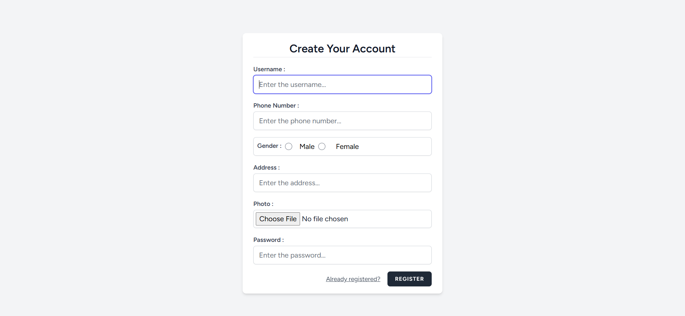
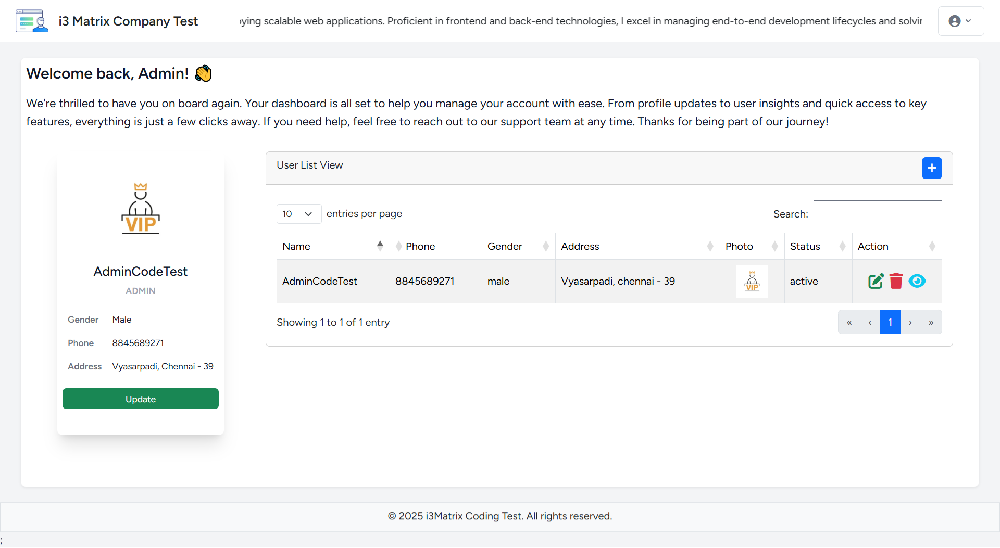
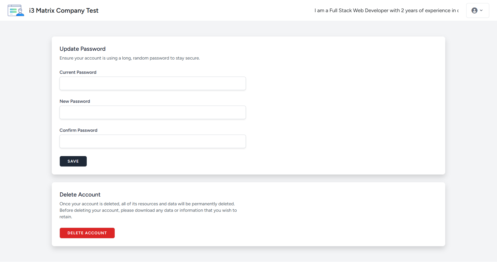

## About Laravel

Laravel is a web application framework with expressive, elegant syntax. We believe development must be an enjoyable and creative experience to be truly fulfilling. Laravel takes the pain out of development by easing common tasks used in many web projects, such as:

- [Simple, fast routing engine](https://laravel.com/docs/routing).
- [Powerful dependency injection container](https://laravel.com/docs/container).
- Multiple back-ends for [session](https://laravel.com/docs/session) and [cache](https://laravel.com/docs/cache) storage.
- Expressive, intuitive [database ORM](https://laravel.com/docs/eloquent).
- Database agnostic [schema migrations](https://laravel.com/docs/migrations).
- [Robust background job processing](https://laravel.com/docs/queues).
- [Real-time event broadcasting](https://laravel.com/docs/broadcasting).

Laravel is accessible, powerful, and provides tools required for large, robust applications.

## Learning Laravel

Laravel has the most extensive and thorough [documentation](https://laravel.com/docs) and video tutorial library of all modern web application frameworks, making it a breeze to get started with the framework.

You may also try the [Laravel Bootcamp](https://bootcamp.laravel.com), where you will be guided through building a modern Laravel application from scratch.

If you don't feel like reading, [Laracasts](https://laracasts.com) can help. Laracasts contains thousands of video tutorials on a range of topics including Laravel, modern PHP, unit testing, and JavaScript. Boost your skills by digging into our comprehensive video library.

## Laravel Sponsors

We would like to extend our thanks to the following sponsors for funding Laravel development. If you are interested in becoming a sponsor, please visit the [Laravel Partners program](https://partners.laravel.com).

### Premium Partners

- **[Vehikl](https://vehikl.com/)**
- **[Tighten Co.](https://tighten.co)**
- **[Kirschbaum Development Group](https://kirschbaumdevelopment.com)**
- **[64 Robots](https://64robots.com)**
- **[Curotec](https://www.curotec.com/services/technologies/laravel/)**
- **[DevSquad](https://devsquad.com/hire-laravel-developers)**
- **[Redberry](https://redberry.international/laravel-development/)**
- **[Active Logic](https://activelogic.com)**

## Contributing

Thank you for considering contributing to the Laravel framework! The contribution guide can be found in the [Laravel documentation](https://laravel.com/docs/contributions).

## Code of Conduct

In order to ensure that the Laravel community is welcoming to all, please review and abide by the [Code of Conduct](https://laravel.com/docs/contributions#code-of-conduct).

## Security Vulnerabilities

If you discover a security vulnerability within Laravel, please send an e-mail to Taylor Otwell via [taylor@laravel.com](mailto:taylor@laravel.com). All security vulnerabilities will be promptly addressed.

## License

The Laravel framework is open-sourced software licensed under the [MIT license](https://opensource.org/licenses/MIT).

# i3-Matrix Company Coding Test

This project is a part of the i3-Matrix Company Coding Test. The application is built using **Laravel** for the backend and **React.js** for the frontend.

## Requirements

Before starting the project, ensure that you have the following installed:

- **PHP** >= 7.4
- **Composer** (for managing PHP dependencies)
- **Node.js** >= 14
- **NPM** (for managing frontend dependencies)
- **MySQL** (or another compatible database)

## Setup Instructions

### Step 1: Clone the Repository

Clone the repository to your local machine and navigate to the project folder:

git clone <repository_url>
cd <repository_folder>

### Step 2 : Set Up the Environment

 #### 1. Copy the .env.example file to .env:
    - This file contains environment-specific configuration settings. Create a copy of it as .env: cp .env.example .env

#### 2. Update the .env file for the database connection:

    - Open the .env file and modify the database connection settings:

        DB_CONNECTION=mysql
        DB_HOST=localhost
        DB_PORT=3306
        DB_DATABASE=i3matrixCodeTestLaravel
        DB_USERNAME=root
        DB_PASSWORD=
    - Ensure that your MySQL server is running and adjust the database credentials as per your local configuration.

    - If you are using a database other than MySQL, make sure to modify the connection settings accordingly.

### Step 3: Install Dependencies

#### 1. Install Laravel dependencies using Composer:

    Run the following command to install PHP dependencies:

    composer install

#### 2. Install frontend dependencies using NPM:

    Install the required Node.js packages:

    npm install

#### 3. Build the frontend assets:

    After installing the dependencies, compile the frontend assets:

    npm run build

### Step 4: Run Migrations

    Run the migration command to create the necessary database tables:

    php artisan migrate

### Step 5: Run the Application

#### 1. Start the Laravel application server:

    Use the following command to start the backend Laravel server:

    php artisan serve
    The server will be running at http://localhost:8000.

#### 2. Run the React development server:

    You can run the React development server for real-time updates:

    npm run dev
    The React app will be available at http://localhost:3000 (by default).

### Step 6: Access the Application

Once everything is set up and the servers are running, you can access the following pages:

Register Page:

Login Page:

Home Page:

Profile Page:

### Demo Video

You can watch a demo of the application here:

<video controls> <source src="path_to_demo_video.mp4" type="video/mp4"> Your browser does not support the video tag. </video>

